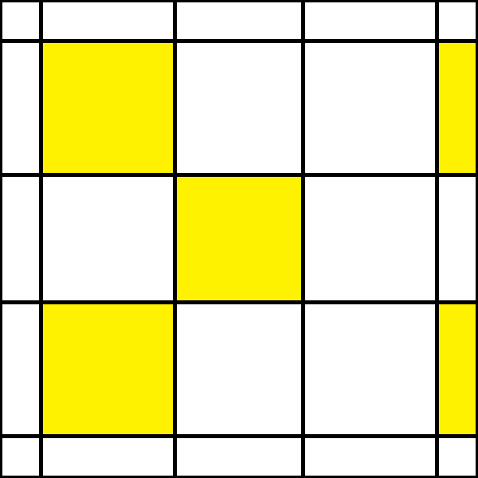
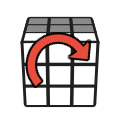
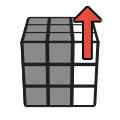
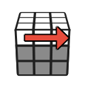
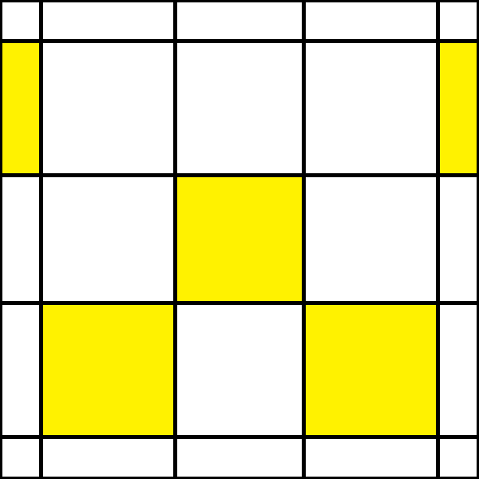
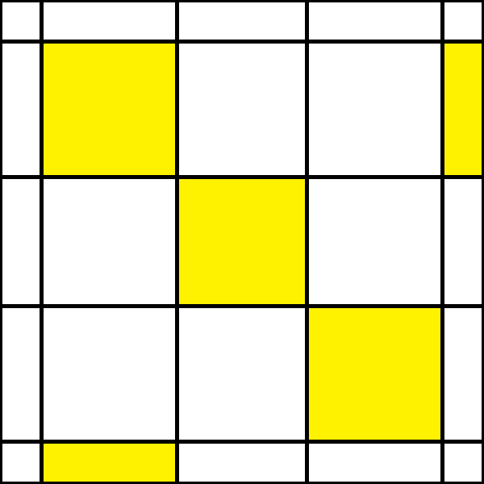
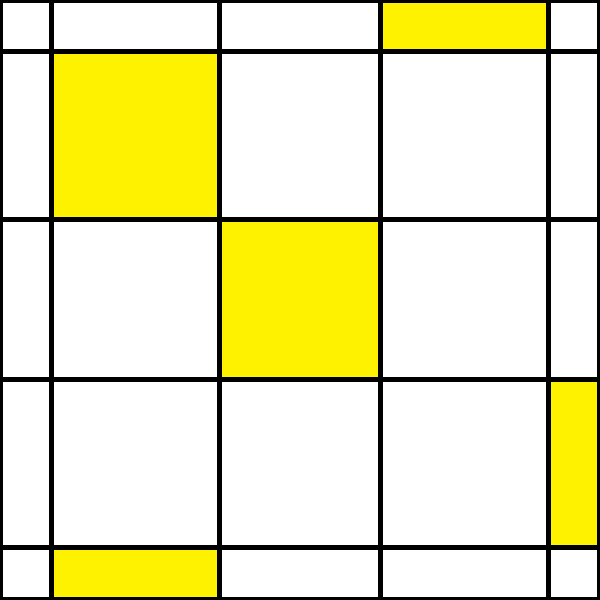
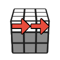
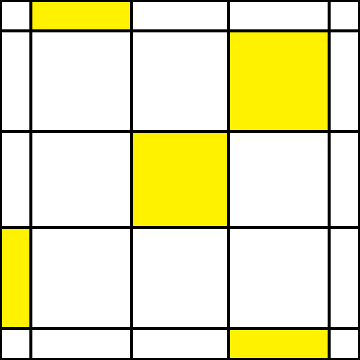
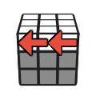

# Rubik's Cube Corners First Method by siredmar

## Notation

## Introduction

##

### Solving Yellow Edges

#### Position 1

|  | <iframe width="250" height="380" style="width: 250px; height: 320px; overflow: hidden;" src="https://ruwix.com/widget/3d/?alg=F%20U%20R%20U'%20R'%20F'&colored=U%20UBL%20UBR%20UFR%20UFL%20D%20DFL%20DFR%20DBR%20DBL&flags=showalg&pov=UFR" scrolling="no"></iframe> |
| ------------------------------------------------------------------------------------------------- | -------------------------------------------------------------------------------------------------------------------------------------------------------------------------------------------------------------------------------------------------------------------- |

     

### Position 2

|  | <iframe width="250" height="380" style="width: 250px; height: 320px; overflow: hidden;" src="https://ruwix.com/widget/3d/?alg=R%20U%20R'%20U'%20F'%20U'%20F&colored=U%20UBL%20UBR%20UFR%20UFL%20D%20DFL%20DFR%20DBR%20DBL&flags=showalg&pov=UFR" scrolling="no"></iframe> |
| ------------------------------------------------------------------------------------------------- | ------------------------------------------------------------------------------------------------------------------------------------------------------------------------------------------------------------------------------------------------------------------------- |

<!-- images for R U R' U' F' U' F -->

      

### Position 3

|  | <iframe width="250" height="380" style="width: 250px; height: 320px; overflow: hidden;" src="https://ruwix.com/widget/3d/?alg=F%20U%20R%20U'%20R'%20U%20R%20U'%20R'%20F'&colored=U%20UBL%20UBR%20UFR%20UFL%20D%20DFL%20DFR%20DBR%20DBL&flags=showalg&pov=UFR" scrolling="no"></iframe> |
| ------------------------------------------------------------------------------------------------- | -------------------------------------------------------------------------------------------------------------------------------------------------------------------------------------------------------------------------------------------------------------------------------------- |

<!-- images for  F U R U' R' U R U' R' F' -->

         

### Position 4

|  | <iframe width="250" height="380" style="width: 250px; height: 320px; overflow: hidden;" src="https://ruwix.com/widget/3d/?alg=F%20R'%20F'%20U'%20R'%20U%20R&colored=U%20UBL%20UBR%20UFR%20UFL%20D%20DFL%20DFR%20DBR%20DBL&flags=showalg&pov=UFR" scrolling="no"></iframe> |
| ------------------------------------------------------------------------------------------------- | ------------------------------------------------------------------------------------------------------------------------------------------------------------------------------------------------------------------------------------------------------------------------- |

<!-- images for F R' F' U' R' U R -->

      

### Position 5a

|  | <iframe width="250" height="380" style="width: 250px; height: 380px; overflow: hidden;" src="https://ruwix.com/widget/3d/?alg=R'%20U'%20R%20U'%20R'%20U2'%20R&colored=U%20UBL%20UBR%20UFR%20UFL%20D%20DFL%20DFR%20DBR%20DBL&flags=showalg&pov=UFR" scrolling="no"></iframe> |
| ------------------------------------------------------------------------------------------------- | --------------------------------------------------------------------------------------------------------------------------------------------------------------------------------------------------------------------------------------------------------------------------- |

<!-- images for R' U' R U' R' U2 R -->

      

### Position 5b (symmetric to 5a)

|  | <iframe width="250" height="380" style="width: 250px; height: 380px; overflow: hidden;" src="https://ruwix.com/widget/3d/?alg=L%20U%20L'%20U%20L%20U2%20L'&colored=U%20UBL%20UBR%20UFR%20UFL%20D%20DFL%20DFR%20DBR%20DBL&flags=showalg&pov=UFR" scrolling="no"></iframe> |
| -------------------------------------------------------------------------------------------------- | ------------------------------------------------------------------------------------------------------------------------------------------------------------------------------------------------------------------------------------------------------------------------ |

<!-- images for L U L' U L U2 L' -->

      